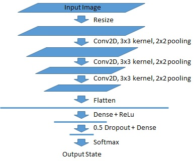

# CarND Capstone Project
This is the project repo for the final project of the Udacity Self-Driving Car Nanodegree: Programming a Real Self-Driving Car.

Based on the starting code from [Udacity](https://github.com/udacity/CarND-Capstone), we implemented the following 3 nodes to complete the project.

## `waypoint_updater`
This node reads the waypoint list, current car position, and the next red light position, then returns the next 35 waypoints to follow, with the target velocity at each waypoint. This node will:

1. Constructs a KD Tree for all waypoints to easily query the nearest one from car position.
2. Check whether the nearest waypoint is ahead or behind the car position, assuming the car follows the direction of waypoints. Only the waypoints in front of the car position are returned.
3. Check whether the next stopline waypoint is in the returned list. If so, then decrease the target velocity of waypoints at or ahead of the stopline to 0 and ones behind the stopline to a lower velocity proportional to  the sqrt of the distance. The default target velocity is set in waypoint_loader which reads the ros parameter `~velocity`.

The returned waypoints with the adjusted target velocity is used by the waypoint_follower to drive the car.

##### Caveats
* The Udacity walk-though suggested 200 waypoints, which is too much and causes lagging problem. Reducing the max waypoint number helps to smooth driving.

## `dbw_node`
This node keeps track of the car status (including ~~position,~~ velocity, angular velocity), the desired car status (velocity and angular velocity), and constantly publishes the DBW commands (throttle, brake, steering) at 50 Hz to make the car follow the desired velocity and angular velocity.
The underlying controller are:
1. A PID controller for throttle and break to get to the target velocity (`twist_controller`).
2. A `yaw_controller` to get to the desired angular velocity using a physics-based function.
3. This node respects the `dbw_enabled` flag and resets the internal states of the controller when the flag turns to false. This prevents the PID error term from accumulating when a human driver takes over the control.

##### Caveats
* This node works reasonable well when the car is closely following the waypoints. However, if the car deviated from the waypoints due to manual control or simply lagging, the behavior becomes wild. Adding the position info into this node may help improve the driving.

## `tl_detector`
The central component of the project. This node uses the camera image, car position, combined with prior knowledge of traffic light positions, to determine if the car should stop in front of the next traffic light. It first checks whether a traffic light is expected in the upcoming waypoints. If so, the `tl_classifier` uses the image from car-mounted camera to classify the traffic light color as RED, YELLOW, GREEN, or UNKNOWN. Note UNKNOWN here typically means no traffic light is found in the image. If all last 3 images are classified as RED traffic light, the waypoint of the next traffic light is published to `/traffic_waypoint` so that `waypoint_updater` node can update the target velocity to make the car stop in front of the traffic light.

### `tl_classifier`
The classifier is constructed as a CNN with the following structure:

| Layer | Output shape |
|:-----:|:------------:|
| Input RGB image | ? x ? x 3 |
| Resize | 224 x 224 x 3 |
| Convolution 3 x 3 (RELU activation) | 222 x 222 x 32 |
| MaxPooling 2 x 2 | 111 x 111 x 32 |
| Convolution 3 x 3 (RELU activation) | 109 x 109 x 32 |
| MaxPooling 2 x 2 | 55 x 55 x 32 |
| Convolution 3 x 3 (RELU activation) | 53 x 53 x 64 |
| MaxPooling 2 x 2 | 27 x 27 x 64 |
| Flatten | 46656 |
| Fully connected | 64 |
| RELU activation | 64 |
| Dropout (prob = 0.5) | 64 |
| Fully connected | 4 |
| Softmax activation (Output) | 1 |

Since the simulator images and site test images are very different, two classifier models are trained to handle both cases.
* In the simulator model, labels are directly retrieved from the light state published by simulator.
* In the site test model, two datasets are used for training. First is the BOSCH dataset with labels already available. The second dataset is the images retrieved from the Udacity site training bag. Labels are manually added here. The two datasets are combined together to train the classifier.
